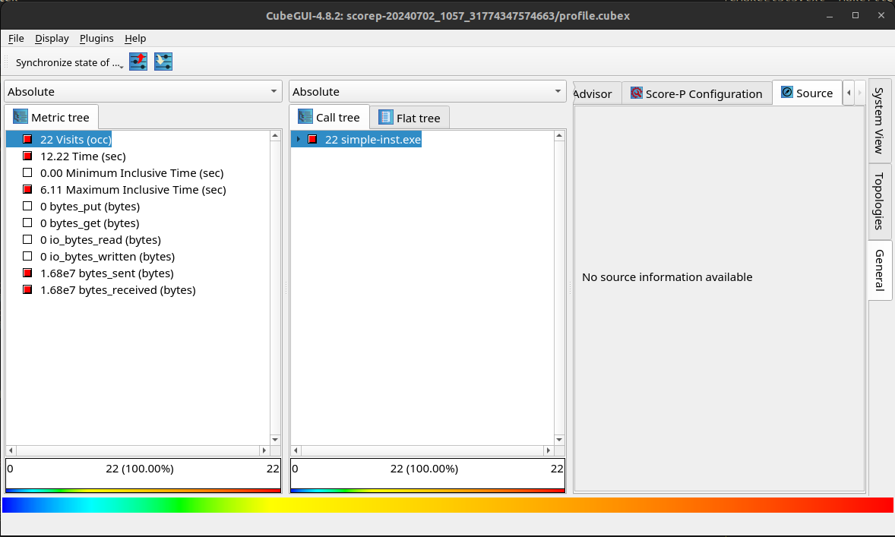

# Score-P demo

In this folder we provide a simplified parallel Fortran program. The program uses MPI and provide a test ground for exploring
the `scorep` profiler. In this example we will use `scorep` to automatically instrument the source code and produce and
instrumented binary.

## Dependencies

To build the examples in this folder you will need the GNU fortran compiler `gfortran`. You will also need an MPI
implementation. I recommend `openmpi` for this example. Installation instructions can be found
[here](https://docs.open-mpi.org/en/v5.0.x/installing-open-mpi/quickstart.html) but also most package managers typically provide
a pre-built package. For example, on Ubuntu you can run `sudo apt-get install libopenmpi-dev` (**Do not run this on a HPC
system**).

We require a working copy of `scorep`. Installation instructions can be found
[here](https://scorepci.pages.jsc.fz-juelich.de/scorep-pipelines/docs/scorep-4.1/html/quickstart.html). I personally recommend
using `spack` to install scorep. But for the purpose of this demo, following the official instructions would be quickest.

For anyone that already has access to `spack` you can use the following `spack.yaml` to create a `spack` environment.

```yaml
spack:
  specs:
  - scorep@8.3
  - openmpi@4.1.6
  - cube@4.8.2
  view: true
  concretizer:
    unify: true
```

The profiles are generated by `scorep` but to view the profiles we use `cube`. `cube` is installed alongside the standard
`scorep` installation, so you should have it available after following the installation instructions.

## Build

To compile the example code, run:

```bash
make
```

This will build all examples. The output should look something like,

```
mpif90 -g -cpp -O2 -o simple.exe simple-mpi.f90
scorep-mpif90 -g -cpp -O2 -o simple-inst.exe simple-mpi.f90
```

Running `ls` you should see the binaries (`*.exe`):

```
$ ls
Makefile  README.md  simple.exe  simple-inst.exe  simple-mpi.f90
```

`simple.exe` is the _normal_ binary i.e., un-instrumented. `simple-inst.exe` has been compiled with the `scorep` compiler
wrapper (`scorep-mpif90`) and it can be used to generate a profile.

## Example

### running the program

To run the _normal_ binary we would use the following command `mpirun -n 2 simple.exe`. This will launch the application with 2
ranks. The output may come out in a slightly different order to the one below, but that is OK.

```
$ mpirun -n 2 simple.exe
 internal process:            0 of            2
 internal process:            1 of            2
 r(1,1) =   0.987176001      on rank            0
 this function takes some time
 r(1,1) =   0.892318726      on rank            1
 this function takes some time
 this function is very quick and does nothing :)
 this function is nested and quick
 this function is very quick and does nothing :)
 this function is nested and quick
 r(1,1) =   0.892318726      on rank            1
 r(1,1) =   0.892318726      on rank            0
```

This is how to run the uninstrumented i.e., _normal_ binary. Now if we want profiling information we need to use the
instrumented binary `simple-inst.exe`.

### Generating a Profile

Like before, we can _just run_ the program and it will automatically produce a profile. This is because it has already been
instrumented with the `scorep` wrapper, `scorep-mpif90`.

```
$ mpirun -n 2 simple-inst.exe
 internal process:            0 of            2
 internal process:            1 of            2
 r(1,1) =   0.130465865      on rank            0
 this function takes some time
 r(1,1) =   0.520857573      on rank            1
 this function takes some time
 this function is very quick and does nothing :)
 this function is nested and quick
 this function is very quick and does nothing :)
 this function is nested and quick
 r(1,1) =   0.520857573      on rank            1
 r(1,1) =   0.520857573      on rank            0
```

The output looks the same as before, and that is because it is. However, if we run `ls` we will see that there is an additional
folder:

```
$ ls
Makefile  README.md  scorep-20240702_1057_31774347574663  simple.exe  simple-inst.exe  simple-mpi.f90
```

It will be called something like `scorep-20240702_1057_31774347574663`. The exact filename will vary as it is followed by a
timestamp i.e., `20240702_1057_31774347574663`.

If we look inside this folder we have the folowing:

```
$ ls scorep-20240702_1057_31774347574663/
MANIFEST.md  profile.cubex  scorep.cfg
```

* `MANIFEST.md` is for information only, and provides a summary of the contents of the other two files
* `scorep.cfg` is the configuration file which contains a listing of used environment variables
* `profile.cubex` the actual profile data which can be opened with `cube` profile viewer

To open the profile in cube, run the following command in the terminal

```
$ cube scorep-20240702_1057_31774347574663/profile.cubex
```

**NOTE** Your exact path will be different to the one above due to the datetime stamp i.e., `20240702_1057_31774347574663`

You should see something like this:


